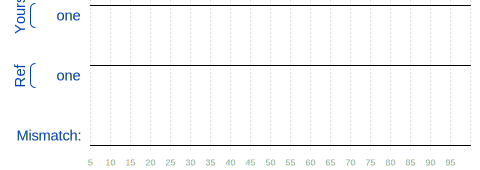

# HDLBits – Getting Started

## 🧩 Problem 1: One

### 📌 Problem Statement

This is the introductory problem on **HDLBits**, designed to help you get familiar with the interface and basic Verilog syntax.

You are required to build a **very simple digital circuit** with:

* **No inputs**
* **One output**
* The output must **always drive logic `1` (HIGH)**

This problem focuses on understanding:

* Module declaration
* Output ports
* Continuous assignments in Verilog

---

### 📄 Module Declaration

```verilog
module top_module( output one );
```

> ⚠️ **Important:**
> The module name (`top_module`) and port name (`one`) **must not be changed**, otherwise HDLBits simulation will fail.

---

### 🎯 Design Requirement

* The output `one` should be permanently tied to logic high (`1`)
* No clocks, inputs, or sequential logic are required

---

### ✅ Solution (Verilog)

```verilog
module top_module( output one );
    assign one = 1'b1;
endmodule
```

---

### 🛠️ Explanation

* `assign` is a **continuous assignment** used to drive combinational signals.
* `1'b1` represents:

  * `1` → bit width
  * `'b` → binary format
  * `1` → logic HIGH

This means the output `one` is **always driven high**, regardless of time or conditions.

---

### 🧪 Simulation Result

* Compilation: ✅ Successful
* Simulation: ✅ Outputs match reference
* Final Status on HDLBits: **Success!**



---

### 🧠 Key Takeaways

* Verilog allows direct assignment of constants to outputs
* Continuous assignments are ideal for simple combinational logic
* This problem establishes the foundation for more complex HDLBits exercises

---

### 📈 Next Steps

Proceed to:

* **Problem 2: Zero**
* **Wires**
* **Basic Logic Gates**

---
