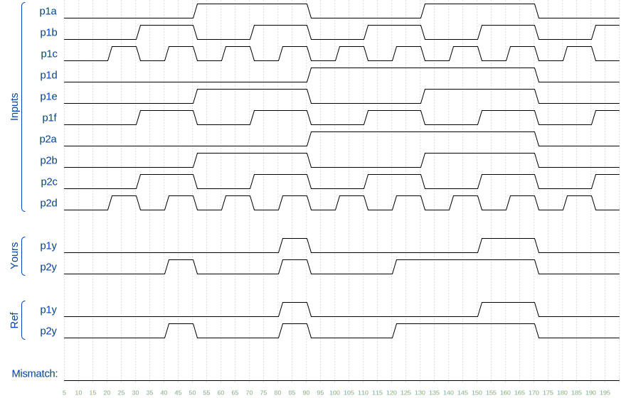

# 🧩 7458 (7458)

> HDLBits – Verilog Basics

---

## 📌 Problem Statement

**Create** a module with the same functionality as the 7458 chip. It has **10 inputs and 2 outputs**. The 7458 is a chip with **four AND gates** and **two OR gates**.

You may choose to use an **assign** statement to drive each of the output wires, or you may choose to declare (four) wires for use as intermediate signals, where each internal wire is driven by the output of one of the AND gates. For extra practice, try it both ways.

---
## 📌 Problem Circuit


---

## 🧠 Concept Covered

* **Bitwise / logical AND and OR Gates**
* **Wire declaration**
* **Continuous assignment**
* **Combinational logic**

---

## 🧱 Module Interface

```
module top_module ( 
    input p1a, p1b, p1c, p1d, p1e, p1f,
    output p1y,
    input p2a, p2b, p2c, p2d,
    output p2y );


endmodule
```

* `p1a, p1b, p1c, p1d, p1e, p1f; p2a, p2b, p2c, p2d`  → input signals
* `p1y, p2y` → output signals

---

## ✅ Verilog Solution (Wire Declaration)

```
module top_module ( 
    input p1a, p1b, p1c, p1d, p1e, p1f,
    output p1y,
    input p2a, p2b, p2c, p2d,
    output p2y );
    
    wire p1and1, p1and2, p2and1, p2and2;
    
    assign p1and1 = p1a && p1b && p1c;
    assign p1and2 = p1d && p1e && p1f;
    assign p1y = p1and1 || p1and2;
    
    assign p2and1 = p1a && p1b;
    assign p2and2 = p1c && p1d;
    assign p2y = p2and1 || p2and2;

endmodule
```

### ✅ Alternative (No Wire Declaration)

```
module top_module ( 
    input p1a, p1b, p1c, p1d, p1e, p1f,
    output p1y,
    input p2a, p2b, p2c, p2d,
    output p2y );
    
    assign p1y = (p1d && p1e && p1f) || (p1a && p1b && p1c);
    assign p2y = (p2a && p2b) || (p2c && p2d);

endmodule
```
---



## 🔍 Explanation

* The `wire` statement creates internal **wires**
* The `assign` statement creates a **continuous connection**
* No procedural blocks are required

---

## 🧪 Expected Behavior

* `p1a = 0; p1b = 0; p1c = 0; p1d = 0; p1e = 0; p1f = 0` → `p1y = 0`
* `p1a = 0; p1b = 0; p1c = 1; p1d = 0; p1e = 0; p1f = 0` → `p1y = 0`
* `p1a = 0; p1b = 1; p1c = 0; p1d = 0; p1e = 0; p1f = 1` → `p1y = 0`
* `p1a = 0; p1b = 1; p1c = 1; p1d = 0; p1e = 0; p1f = 1` → `p1y = 0`
* `p1a = 1; p1b = 0; p1c = 0; p1d = 0; p1e = 1; p1f = 0` → `p1y = 0`
* `p1a = 1; p1b = 0; p1c = 1; p1d = 0; p1e = 1; p1f = 0` → `p1y = 0`
* `p1a = 1; p1b = 1; p1c = 0; p1d = 0; p1e = 1; p1f = 1` → `p1y = 0`
* `p1a = 1; p1b = 1; p1c = 1; p1d = 0; p1e = 1; p1f = 1` → `p1y = 1`
* `p1a = 0; p1b = 0; p1c = 0; p1d = 1; p1e = 0; p1f = 0` → `p1y = 0`
* `p1a = 0; p1b = 0; p1c = 1; p1d = 1; p1e = 0; p1f = 0` → `p1y = 0`
* `p1a = 0; p1b = 1; p1c = 0; p1d = 1; p1e = 0; p1f = 1` → `p1y = 0`
* `p1a = 0; p1b = 1; p1c = 1; p1d = 1; p1e = 0; p1f = 1` → `p1y = 0`
* `p1a = 1; p1b = 0; p1c = 0; p1d = 1; p1e = 1; p1f = 0` → `p1y = 0`
* `p1a = 1; p1b = 0; p1c = 1; p1d = 1; p1e = 1; p1f = 0` → `p1y = 0`
* `p1a = 1; p1b = 1; p1c = 0; p1d = 1; p1e = 1; p1f = 1` → `p1y = 1`
* `p1a = 1; p1b = 1; p1c = 1; p1d = 1; p1e = 1; p1f = 1` → `p1y = 1`

* `p2a = 0; p2b = 0; p2c = 0; p2d = 0;` → `p2y = 0`
* `p2a = 0; p2b = 0; p2c = 0; p2d = 1;` → `p2y = 0`
* `p2a = 0; p2b = 0; p2c = 1; p2d = 0;` → `p2y = 0`
* `p2a = 0; p2b = 0; p2c = 1; p2d = 1;` → `p2y = 1`
* `p2a = 0; p2b = 1; p2c = 0; p2d = 0;` → `p2y = 0`
* `p2a = 0; p2b = 1; p2c = 0; p2d = 1;` → `p2y = 0`
* `p2a = 0; p2b = 1; p2c = 1; p2d = 0;` → `p2y = 0`
* `p2a = 0; p2b = 1; p2c = 1; p2d = 1;` → `p2y = 1`
* `p2a = 1; p2b = 0; p2c = 0; p2d = 0;` → `p2y = 0`
* `p2a = 1; p2b = 0; p2c = 0; p2d = 1;` → `p2y = 0`
* `p2a = 1; p2b = 0; p2c = 1; p2d = 0;` → `p2y = 0`
* `p2a = 1; p2b = 0; p2c = 1; p2d = 1;` → `p2y = 1`
* `p2a = 1; p2b = 1; p2c = 0; p2d = 0;` → `p2y = 1`
* `p2a = 1; p2b = 1; p2c = 0; p2d = 1;` → `p2y = 1`
* `p2a = 1; p2b = 1; p2c = 1; p2d = 0;` → `p2y = 1`
* `p2a = 1; p2b = 1; p2c = 1; p2d = 1;` → `p2y = 1`


The timing diagram confirms **proper behavior of the circuit**.

✔️ HDLBits Simulation Status: **SUCCESS**

---

## ⚠️ Common Mistakes

* ❌ Forgetting `assign`
* ❌ Forgetting `misspelling`
* ❌ Assigning to the wrong wire/input/output
* ❌ Using `always` for simple logic
* ❌ Confusing `AND` and `OR` gates
* ❌ Declaring `out` as `reg`

---

## 🎯 Takeaway

> **Continuous assignments are ideal for simple combinational logic like logic gates.**

This problem introduces designing a **7458 chip**.

---

### 🟢 Difficulty

**Easy**

---
