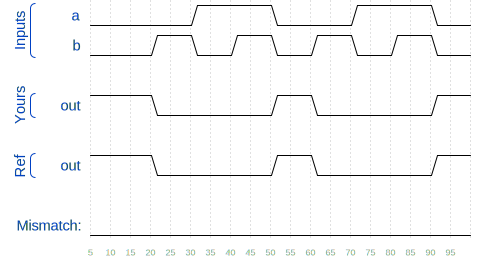

# 🧩 NOR Gate (norgate)

> HDLBits – Verilog Basics

---

## 📌 Problem Statement

Create a module that implements a **NOR gate**. A **NOR** function needs two operators when written in Verilog.

The module has **two inputs** and **one output**.
The output must continuously drive the **opposite of the sum** of the inputs.

---


---

## 🧠 Concept Covered

* **Bitwise / logical NOR**
* **Continuous assignment**
* **Combinational logic**

---

## 🧱 Module Interface

```verilog
module top_module( 
    input a, 
    input b, 
    output out );

endmodule
```

* `a, b`  → input signals
* `out` → output signal

---

## ✅ Verilog Solution

```verilog
module top_module( 
    input a, 
    input b, 
    output out );
    
    assign out = !(a || b);

endmodule
```

### ✅ Alternatives (Bitwise NOR)

```verilog
module top_module( 
    input a, 
    input b, 
    output out );
    
    assign out = ~(a | b);

endmodule
```

```verilog
module top_module( 
    input a, 
    input b, 
    output out );
    
    assign out = !(a | b);

endmodule
```

```verilog
module top_module( 
    input a, 
    input b, 
    output out );
    
    assign out = ~(a || b);

endmodule
```

All are valid here since `a and b` are **1-bit wide**.

---



## 🔍 Explanation

* The `assign` statement creates a **continuous connection**
* `!(a||b)` (logical NOR) is the opposite sum of `a and b`
* Whenever `a or b` change, `out` updates immediately
* No procedural blocks are required

---

## 🧪 Expected Behavior

* `a = 0; b = 0` → `out = 1`
* `a = 0; b = 1` → `out = 0`
* `a = 1; b = 0` → `out = 0`
* `a = 1; b = 1` → `out = 0`

The timing diagram confirms **perfect opposite of the summation**.

✔️ HDLBits Simulation Status: **SUCCESS**

---

## ⚠️ Common Mistakes

* ❌ Forgetting `assign`
* ❌ Using `always` for simple logic
* ❌ Confusing `||` and `|` for multi-bit signals
* ❌ Declaring `out` as `reg`

---

## 🎯 Takeaway

> **Continuous assignments are ideal for simple combinational logic like logic gates.**

This problem introduces the **first logic operation with two operators** beyond simple wiring.

---

### 🟢 Difficulty

**Easy**

---
