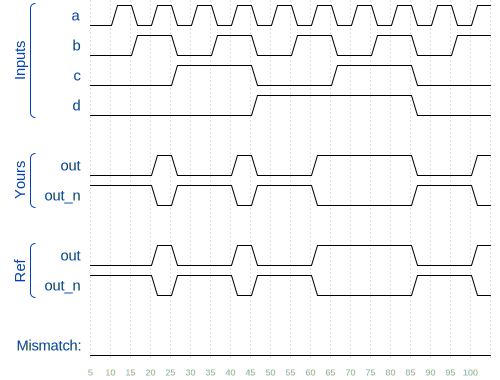

# 🧩 Wire Declaration (wiredecl)

> HDLBits – Verilog Basics

---

## 📌 Problem Statement

As circuits become more complex, you will need wires to connect internal components together. Declare the **wire** in the body of the module, somewhere before it is first used. (In the future, you will encounter more types of signals and variables that are also declared the same way, but for now, we'll start with a signal of type **wire**).

**Create** a module that implements **two internal wires** that connect the **AND** and **OR** gates together. The internal wires can have any name.

The module has **four inputs**, **two wires**, and **two output**.

## 📌 Example


```
module top_module (
    input in,              // Declare an input wire named "in"
    output out             // Declare an output wire named "out"
);

    wire not_in;           // Declare a wire named "not_in"

    assign out = ~not_in;  // Assign a value to out (create a NOT gate).
    assign not_in = ~in;   // Assign a value to not_in (create another NOT gate).

endmodule   // End of module "top_module"
```
This module has three wires (**in**, **out**, and **not_in**). **in** and **out** are declared in the module statement as the module's input and output. The **not_in** wire is internal and must be declared within the module. After the **not_in** declaration, the two **NOT** are created in the assign statements.

---


---

## 🧠 Concept Covered

* **Bitwise / logical AND, OR, NOT**
* **Wire declaration**
* **Continuous assignment**
* **Combinational logic**

---

## 🧱 Module Interface

```
`default_nettype none
module top_module(
    input a,
    input b,
    input c,
    input d,
    output out,
    output out_n   ); 

endmodule
```

* `a, b, c, d`  → input signals
* `out, out_n` → output signals

---

## ✅ Verilog Solution

```
`default_nettype none
module top_module(
    input a,
    input b,
    input c,
    input d,
    output out,
    output out_n   );
    
    wire and1_out, and2_out;
    
    assign and1_out = a && b;
    assign and2_out = c && d;
    assign out = and1_out || and2_out;
    assign out_n = !out;

endmodule
```

### ✅ Alternatives (Wire Decl)

```Many alternatives exist based on the use of logical or bitwise operators.
```
---



## 🔍 Explanation

* The `wire` statement creates an internal **wire**
* The `assign` statement creates a **continuous connection**
* No procedural blocks are required

---

## 🧪 Expected Behavior **TODO**

* `a = 0; b = 0` → `out = 1`
* `a = 0; b = 1` → `out = 0`
* `a = 1; b = 0` → `out = 0`
* `a = 1; b = 1` → `out = 1`

The timing diagram confirms **perfect opposite of the exclusive summation**. **TODO**

✔️ HDLBits Simulation Status: **SUCCESS**

---

## ⚠️ Common Mistakes **TODO**

* ❌ Forgetting `assign`
* ❌ Using `always` for simple logic
* ❌ Forgetting `^` is only for single-bit signals
* ❌ Confusing `!` and `~` for multi-bit signals
* ❌ Declaring `out` as `reg`

---

## 🎯 Takeaway **TODO**

> **Continuous assignments are ideal for simple combinational logic like logic gates.**

This problem introduces the **Another logic operation with two operators** beyond simple wiring.

---

### 🟢 Difficulty

**Easy**

---
