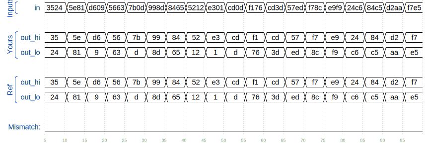

# 🧩 Vectors in more detail (Vector1)

> HDLBits – Verilog Basics

---
## 📌 Background

**Vectors** are used to group related signals using one name to make it more convenient to manipulate. For example, **wire [7:0] w;** declares an 8-bit vector named **w** that is functionally equivalent to having 8 separate wires.

**Declaring Vectors**
Vectors must be declared:

```
type [upper:lower] vector_name;
```

**type** specifies the datatype of the **vector**. This is usually **wire** or **reg**. If you are declaring a input or output port, the type can additionally include the port type (e.g., **input** or **output**) as well. Some examples:

```
wire [7:0] w;         // 8-bit wire
reg  [4:1] x;         // 4-bit reg
output reg [0:0] y;   // 1-bit reg that is also an output port (this is still a vector)
input wire [3:-2] z;  // 6-bit wire input (negative ranges are allowed)
output [3:0] a;       // 4-bit output wire. Type is 'wire' unless specified otherwise.
wire [0:7] b;         // 8-bit wire where b[0] is the most-significant bit.
```

**Endianness:**
Informally 'direction' of the vector, **endianess** is whether the least-significant bit (**LSB**) is the lowest index, called **little-endian** (e.g. 0xA = 4'b1010 is stored in vec[3:0] as [0101]; kind of a reverse order), or the highest index, called the **big-endian** (e.g. 0xA = 4'b1010 is stored in vec[0:3] as [1010]; kind of in reading order).

**Always use the same endianness for the life of the vector (e.g. always keep a vector as little-endian or big-endian; do not swap)**


**Implicit nets (Something to avoid):**
Implicit nets are often a source of hard-to-detect bugs. In Verilog, net-type signals can be implicitly created by an assign statement or by attaching something undeclared to a module port. Implicit nets are always one-bit wires and causes bugs if you had intended to use a vector. Disabling creation of implicit nets can be done using the directive:
```
`default_nettype none
```

**Implicit Net Example:**
```
wire [2:0] a, c;   // Two vectors
assign a = 3'b101;  // a = 101
assign b = a;       // b =   1  implicitly-created wire
assign c = b;       // c = 001  <-- bug
my_module i1 (d,e); // d and e are implicitly one-bit wide if not declared.
                    // This could be a bug if the port was intended to be a vector.
```
Adding `default_nettype none would make the second line of code an error, which makes the bug more visible.


**Unpacked vs. Packed Arrays:**
You may have noticed that in declarations, the vector indices are written before the vector name. This declares the "packed" dimensions of the array, where the bits are "packed" together into a blob (this is relevant in a simulator, but not in hardware). The unpacked dimensions are declared after the name. They are generally used to declare memory arrays.

```
reg [7:0] mem [255:0];   // 256 unpacked elements, each of which is a 8-bit packed vector of reg.
reg mem2 [28:0];         // 29 unpacked elements, each of which is a 1-bit reg.
```

**Accessing Vector Elements: Part-Select:**
Accessing an entire vector is done using the vector name. For example:

```
assign w = a;
```

takes the entire 4-bit vector a and assigns it to the entire 8-bit vector w (declarations are taken from above). If the lengths of the right and left sides don't match, it is zero-extended or truncated as appropriate.

The part-select operator can be used to access a portion of a vector:

```
wire [7:0] w;         // 8-bit wire
reg  [4:1] x;         // 4-bit reg
input wire [3:-2] z;  // 6-bit wire input (negative ranges are allowed)
wire [0:7] b;         // 8-bit wire where b[0] is the most-significant bit.


w[3:0]      // Only the lower 4 bits of w
x[1]        // The lowest bit of x
x[1:1]      // ...also the lowest bit of x
z[-1:-2]    // Two lowest bits of z
b[3:0]      // Illegal. Vector part-select must match the direction of the declaration.
b[0:3]      // The *upper* 4 bits of b.
assign w[3:0] = b[0:3];    // Assign upper 4 bits of b to lower 4 bits of w. w[3]=b[0], w[2]=b[1], etc.
```

---

## 📌 Problem Statement

**Build** a combinational circuit that splits an input half-word (16 bits, [15:0] ) into lower [7:0] and upper [15:8] bytes.

---
## 📌 Problem Circuit


A tick mark with a number next to it indicates the width of the vector (or "bus"). This is easier than drawing a separate line for each bit in the vector.

---

## 🧠 Concept Covered

* **Vector declaration**
* **Vector Part-selection**
* **Continuous assignment**

---

## 🧱 Module Interface

```
`default_nettype none     // Disable implicit nets. Reduces some types of bugs.
module top_module( 
    input wire [15:0] in,
    output wire [7:0] out_hi,
    output wire [7:0] out_lo );

endmodule
```

* `[15:0] in`  → input signals
* `[7:0] out_hi, [7:0] out_lo` → output signals

---

## ✅ Verilog Solution

```
`default_nettype none     // Disable implicit nets. Reduces some types of bugs.
module top_module( 
    input wire [15:0] in,
    output wire [7:0] out_hi,
    output wire [7:0] out_lo );
    
    assign out_hi = in[15:8];
    assign out_lo = in[7:0];

endmodule
```

### ✅ Alternative (Concatenation)

```
`default_nettype none     // Disable implicit nets. Reduces some types of bugs.
module top_module( 
    input wire [15:0] in,
    output wire [7:0] out_hi,
    output wire [7:0] out_lo );
    
    assign {out_hi, out_lo} = in; // Concatenation operator also works

endmodule
```
---



## 🔍 Explanation

* The `datatype [x:y] vec_name` statement creates a **vector** of that datatype with x-y # of bits
* The `vec_name[x]` statement selects a specific bit/bits from a vector
* The `assign` statement creates a **continuous connection**
* `[MSB:0] vec` is **big-endian**; `[LSB:0] vec` is **little-endian**
* No procedural blocks are required

---

## 🧪 Expected Behavior

* `in = 0x3524` → `out_hi = 0x35; out_lo = 0x24;`
* `in = 0x5e81` → `out_hi = 0x5e; out_lo = 0x81;`


The timing diagram confirms **proper behavior of the circuit**.

✔️ HDLBits Simulation Status: **SUCCESS**

---

## ⚠️ Common Mistakes

* ❌ Forgetting `assign`
* ❌ Forgetting `endianness (big [MSB:0] or little [LSB:0])`
* ❌ Using `always` for simple logic
* ❌ Confusing the bits in a vector
* ❌ Declaring `out` as `reg`

---

## 🎯 Takeaway

> *Sections of vectors can be selected and assigned to other variables**

This problem introduces part-selection, endianness, and declaration of **vectors**.

---

### 🟢 Difficulty

**Easy**

---
