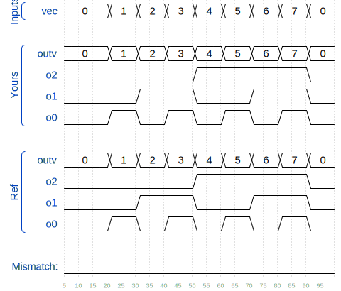

# 🧩 Vector part select (Vector2)

> HDLBits – Verilog Basics

---

## 📌 Problem Statement

A **32-bit vector** can be viewed as containing **4 bytes** (bits **[31:24]**, **[23:16]**, etc.). **Build** a circuit that will reverse the byte ordering of the **4-byte word**.

`AaaaaaaaBbbbbbbbCcccccccDddddddd => DdddddddCcccccccBbbbbbbbAaaaaaaa`

This operation is often used when the **endianness** of a piece of data needs to be swapped, for example between **little-endian x86 systems** and the **big-endian** formats used in many **Internet protocols**.

---
## 📌 Problem Circuit **TODO: ALL BELOW**


A tick mark with a number next to it indicates the width of the vector (or "bus"). This is easier than drawing a separate line for each bit in the vector.

---

## 🧠 Concept Covered

* **Vector declaration**
* **Vector Part-selection**
* **Continuous assignment**

---

## 🧱 Module Interface

```
module top_module ( 
    input wire [2:0] vec,
    output wire [2:0] outv,
    output wire o2,
    output wire o1,
    output wire o0  ); // Module body starts after module declaration

endmodule
```

* `[2:0] vec`  → input signals
* `[2:0] outv, o2, o1, o0` → output signals

---

## ✅ Verilog Solution

```
module top_module ( 
    input wire [2:0] vec,
    output wire [2:0] outv,
    output wire o2,
    output wire o1,
    output wire o0  ); // Module body starts after module declaration
    
    assign outv = vec;
    assign o0 = vec[0];
    assign o1 = vec[1];
    assign o2 = vec[2];

endmodule
```

### ✅ Alternative (No Wire Declaration)

```
The order of the **assign** statements does not impact the result.
```
---



## 🔍 Explanation

* The `datatype [x:y] vec_name` statement creates a **vector** of that datatype with x-y # of bits
* The `vec_name[x]` statement selects a specific bit/bits from a vector
* The `assign` statement creates a **continuous connection**
* No procedural blocks are required

---

## 🧪 Expected Behavior

* `vec = 3'b000 = d'0;` → `outv = 0; o0 = 0; o1 = 0; o2 = 0`
* `vec = 3'b001 = d'1;` → `outv = 1; o0 = 1; o1 = 0; o2 = 0`
* `vec = 3'b010 = d'2;` → `outv = 2; o0 = 0; o1 = 1; o2 = 0`
* `vec = 3'b011 = d'3;` → `outv = 3; o0 = 1; o1 = 1; o2 = 0`
* `vec = 3'b100 = d'4;` → `outv = 4; o0 = 0; o1 = 0; o2 = 1`
* `vec = 3'b101 = d'5;` → `outv = 5; o0 = 1; o1 = 0; o2 = 1`
* `vec = 3'b110 = d'6;` → `outv = 6; o0 = 0; o1 = 1; o2 = 1`
* `vec = 3'b111 = d'7;` → `outv = 7; o0 = 1; o1 = 1; o2 = 1`


The timing diagram confirms **proper behavior of the circuit**.

✔️ HDLBits Simulation Status: **SUCCESS**

---

## ⚠️ Common Mistakes

* ❌ Forgetting `assign`
* ❌ Forgetting `misspelling`
* ❌ Assigning to the wrong wire/input/output
* ❌ Using `always` for simple logic
* ❌ Confusing the bits in a vector
* ❌ Declaring `out` as `reg`

---

## 🎯 Takeaway

> **Vectors allow for simpler implementation of multiple bits**

This problem introduces declaration of **vectors**.

---

### 🟢 Difficulty

**Easy**

---
